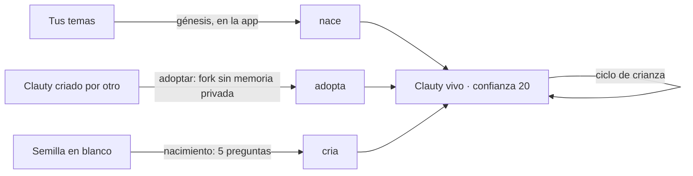
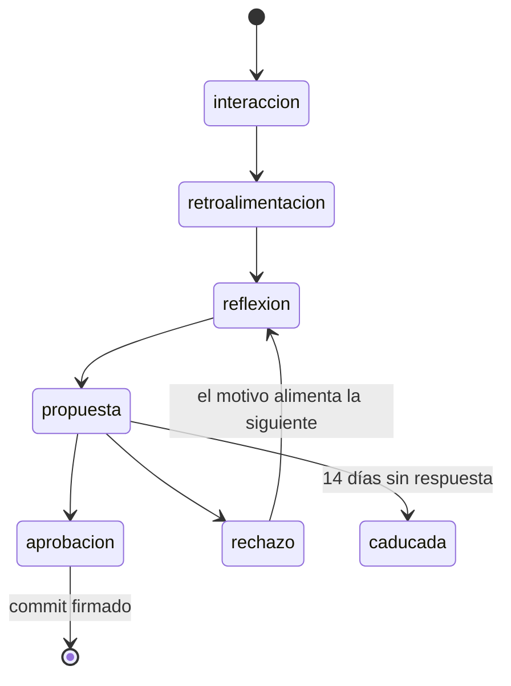

# crianza/ — cómo cambia un Clauty

**Qué es.** La crianza agéntica: un Clauty se moldea con la interacción, la retroalimentación y la reflexión, y cada cambio a su alma lo aprueba su dueño. **Crianza no es entrenamiento:** nunca toca los pesos del modelo ni produce datos de entrenamiento; cambia archivos legibles y deja una historia firmada de cada cambio. Aquí viven el ciclo, la confianza ganada, los tres caminos (nacer, adoptar, criar), exportar, olvidar y la guía para criar tu primer Clauty.

## Epics que la alimentan

| Epic | Título |
|---|---|
| T3.1 | Ciclo: interacción → retroalimentación → reflexión → propuesta → aprobación |
| T3.2 | Crianza como git: cada cambio de alma es un commit firmado |
| T3.3 | Confianza ganada de 20 a 100 |
| T3.4 | Pedigrí verificable (lo público: formato y verificador) |
| T3.5 | Adoptar un Clauty criado (fork sin memoria privada) |
| T3.6 | Exportar/importar |
| T3.7 | Olvidar selectivo |
| T3.8 | Métricas de crianza (lo público: definiciones y cálculo local) |
| T3.9 | Guía "cría tu primer Clauty" |
| T5.6 | Tres caminos: nacen, se adoptan, se crían |

## Especificación v0

### 1. Tres caminos

| Camino | `acta.origen` | Dónde vive | Qué recibe |
|---|---|---|---|
| **Nace** | `nace` | la app (la génesis es privada) | un alma nueva, nacida de los temas recurrentes del dueño |
| **Se adopta** | `adopta` | aquí: `clauty adoptar` | alma, skills e historia de crianza de otro; nunca su memoria privada |
| **Se cría** | `cria` | aquí: `clauty nuevo` | la [semilla en blanco](../semilla/README.md) |



Los tres terminan igual: una carpeta que pasa el validador, con confianza 20 y su primer commit firmado.

### 2. El ciclo



| Regla | Detalle |
|---|---|
| Solo el dueño aprueba | `aprobar` y `rechazar` exigen origen `OWNER`. Desde `EXTERNAL`, `AGENT` o `MIKENET` fallan y el alma no cambia |
| Propuesta = diff + evidencia | sin evidencia (ids de eventos) no hay propuesta. El diff solo puede tocar `SOUL.md`, `skills/` o `confianza.yaml` |
| Caducidad | una propuesta sin respuesta en 14 días pasa a `caducada` y aparece en `pendientes --vencidas` |
| Anti-fatiga | máximo 3 propuestas abiertas por día; la cuarta espera en cola |
| El rechazo enseña | la siguiente reflexión cita el motivo del rechazo |
| Crianza no es entrenamiento | el esquema del evento no admite campos de datos de entrenamiento o ajuste de pesos |

Esquema del evento: [`alma/esquemas/evento-crianza.schema.json`](../alma/esquemas/evento-crianza.schema.json). Tipos: `retroalimentacion`, `reflexion`, `propuesta`, `aprobacion`, `rechazo`, `olvido`, `adopcion`, `confianza`. Registro: `crianza/eventos.jsonl` dentro de la carpeta del Clauty, una línea por evento.

### 3. Crianza como git

La carpeta de un Clauty es un repo git. Nada se reescribe.

- `iniciar` hace `git init`, crea `.clauty/allowed_signers` y el primer commit firmado.
- **Un evento aprobado = un commit** con los trailers `Crianza-Evento: <id>` y `Aprobado-por: <did o llave del dueño>`.
- Firma Ed25519 con `gpg.format=ssh`. Mientras no exista la llave por Clauty del protocolo, firma la llave SSH Ed25519 del dueño.
- `.clauty/cabezas.log` guarda cada HEAD aprobado; si una cabeza registrada deja de ser ancestro de HEAD, alguien reescribió la historia y `verificar` falla.
- Revertir es un commit nuevo (evento `aprobacion` con `reversa_de`).
- Experimentos en ramas `experimento/<nombre>`; integrarlas a `main` exige aprobación.
- `verificar` recorre toda la cadena **sin red**: falla ante un commit sin firma válida, sin trailer `Crianza-Evento`, reescrito, o ante `confianza.yaml` cambiado sin evento.

### 4. Confianza ganada (20 → 100)

| Hecho | Delta |
|---|---|
| Acierto aprobado | +2 |
| Retroalimentación positiva | +1 |
| Error | −5 |
| Acción revertida | −10 |
| Incidente de seguridad | `congelado: true` |

- Techo de subida: +10 por semana calendario.
- Bajar es inmediato; subir se aplica al cierre del día.
- Sin un evento `aprobacion` explícito, la confianza se detiene en 94: el nivel `sistema` (95) está reservado.
- Decaimiento: tras 30 días sin interacción, −1 por semana, con piso de 20.
- Cada alcance (`por_alcance`) sube por separado: los aciertos en calendario no suben pagos.
- Todo cambio de nivel es un evento `confianza` con delta y motivo.
- Prueba de cordura: 90 días de uso típico terminan entre 55 y 75, nunca en 95 o más.

Los umbrales que desbloquean cada clase de acción están en [`alma/`](../alma/README.md#7-confianza-confianzayaml); la autonomía que permite cada nivel, en [`guardian/politicas/autonomia.yaml`](../guardian/politicas/autonomia.yaml).

### 5. Adoptar

| Se lleva | No se lleva |
|---|---|
| `SOUL.md` (idéntico, salvo el nombre si se cambia) | memoria con `privada: true` o sin el campo |
| skills, en `estado: propuesta` | `REFLECTION.md` (llega vacía) |
| historia de crianza del alma (mismos árboles de `SOUL.md`) | la confianza: vuelve a 20 y `por_alcance` queda vacío |
| `ficha.licencia` | secretos (si hay uno, `adoptar` falla y no escribe nada) |

El destino queda con `acta.origen: adopta` y `padres: [<id>@<version_alma>]`. Se adopta desde una carpeta, una URL git o un paquete `.clauty`; los tres dan el mismo `SOUL.md`. Si el origen no declara licencia, hay que pasar `--acepto-sin-licencia`.

### 6. Exportar e importar: el paquete `.clauty`

- Un `tar.gz` con `manifiesto.json` (versión de formato y `sha256` de cada archivo) y el repo git del Clauty.
- Por defecto **sin lo privado** (memoria privada y reflexión). Con lo privado, solo **cifrado** (supuesto v0: `age`).
- `importar` valida antes de escribir (hashes, `verificar`, validador) y **nunca pisa**: si el destino existe, crea `<id>-importado-<AAAAMMDD>`.
- Ida y vuelta sin pérdida: el árbol importado tiene el mismo hash que el original.
- Topes: 50 MB por paquete y 5 MB por archivo no declarado.
- Importa también carpetas de v1 (vía la migración de `alma/`).
- **Si Clauty no existe:** `tar -xzf` deja `SOUL.md`, `MEMORY.md` y `REFLECTION.md` como Markdown legible. Modo análogo.

### 7. Olvidar

Olvidar de verdad, no esconder.

- Por id (`olvidar M-0007`) o por tema (`--tema <texto> --vista-previa`, que no cambia nada).
- Más de 10 entradas en una orden exige `--confirmo <n>` con el número exacto.
- **Borrado criptográfico:** las entradas privadas se guardan en git cifradas, cada una con su llave en `.clauty/llaves-memoria/` (fuera de git). Olvidar destruye la llave; ni `git log -p` recupera el texto. La copia de trabajo sigue siendo Markdown legible.
- Queda un **recibo** firmado: fecha y cantidad, nunca textos ni claves.
- Las reflexiones que citaban lo olvidado se redactan como `[olvidado]`.
- Revocar un conector olvida lo que trajo (`--fuente conector:<nombre>`).
- Si alguien te pide que tu Clauty se olvide de él: el Clauty puede proponerlo; lo ejecuta el dueño.

### 8. Pedigrí (formato público)

`PEDIGRI.yaml` firmado: `clauty`, `padres`, `criadores` (llave pública y rol, sin nombre obligatorio), `versiones` (hash del árbol por `version_alma`) y `firmas`. Cada versión publicada lleva su `.ots` (OpenTimestamps); el verificador corre `ots verify` si hay red y, si no, reporta `pendiente` sin fallar. El pedigrí **solo lleva hashes**: ningún texto de la memoria. Si la llave de un criador se revoca, sus versiones posteriores a la revocación quedan `no_confiable`. Emitir y consultar pedigrís es un servicio de la app; verificarlos, no.

### 9. Métricas

Locales, sin red, calculadas desde `git log` y `eventos.jsonl`:

| Métrica | Fórmula |
|---|---|
| Tasa de aprobación | aprobaciones ÷ propuestas resueltas |
| Días hasta confianza 60 | fecha del primer `nivel ≥ 60` − nacimiento |
| Reversas por semana | eventos con `reversa_de` ÷ semanas |
| Olvidos por mes | recibos de olvido ÷ meses |
| Avance hacia objetivos | según el indicador de cada `objetivos[]` de `clauty.yaml` |

Si el rechazo pasa de 50% en 2 semanas, aviso `revisar-alma`. **Prohibido** medir el tiempo en la app o los mensajes por día como éxito: Clauty sirve a tus objetivos, no al engagement. Los agregados entre usuarios solo existen en la app y solo con permiso explícito.

### 10. Interfaz de línea de comandos (contrato)

```
node crianza/cli.mjs iniciar <carpeta>
node crianza/cli.mjs retro <carpeta> --valor positiva|negativa --texto "..."
node crianza/cli.mjs proponer <carpeta> --diff <archivo.patch> --evidencia <id>
node crianza/cli.mjs aprobar|rechazar <id> [--motivo "..."]
node crianza/cli.mjs pendientes [--vencidas]
node crianza/cli.mjs verificar <carpeta>
node crianza/cli.mjs revertir <id-evento>
node crianza/cli.mjs log <carpeta>             # una línea por evento, en español
node crianza/cli.mjs diff <carpeta> <v1> <v2>  # diff semántico: temperatura: 0.3 → 0.5
node crianza/cli.mjs probar <carpeta> <nombre>
node crianza/cli.mjs adoptar <origen> <destino> [--acepto-sin-licencia]
node crianza/cli.mjs exportar <carpeta> <archivo.clauty> [--con-privado --cifrar]
node crianza/cli.mjs importar <archivo.clauty> <destino> [--desde-v1]
node crianza/cli.mjs olvidar <carpeta> <M-####> | --tema <texto> [--vista-previa] [--confirmo <n>] | --fuente conector:<nombre>
node crianza/cli.mjs metricas <carpeta> [--json]
```

La CLI `clauty` de la sobrecapa ([`openclaw/`](../openclaw/README.md)) expone los mismos verbos (`clauty nuevo`, `clauty adoptar`, `clauty exportar`…).

### 11. Guía "cría tu primer Clauty"

`crianza/GUIA.md`: cinco pasos de ≤ 15 minutos, cada uno con un bloque `bash` y una línea `Comprueba:`. (1) instalar con la línea fijada a tag del README; (2) nacer; (3) primer cambio aprobado; (4) ver la historia firmada; (5) respaldo e ida y vuelta. Más `## Modo análogo: si se apaga Clauty` y `## In English` (≤ 200 palabras). El CI ejecuta todos sus bloques en un contenedor limpio.

## Criterios de aceptación v0

- [ ] Simulación de punta a punta: 5 interacciones → 1 propuesta → aprobación del dueño → `SOUL.md` cambia y `version_alma` sube en 1.
- [ ] Una aprobación con origen distinto de `OWNER` falla y no cambia el alma.
- [ ] `verificar` sale ≠ 0 con un commit sin firma, uno sin evento y uno reescrito; sale 0 en la fixture sana, sin red.
- [ ] Adoptar una fixture con memoria privada deja 0 entradas privadas y confianza 20.
- [ ] Después de olvidar, ni el historial ni una exportación recuperan el texto.
- [ ] La simulación de 90 días de confianza cae entre 55 y 75.
