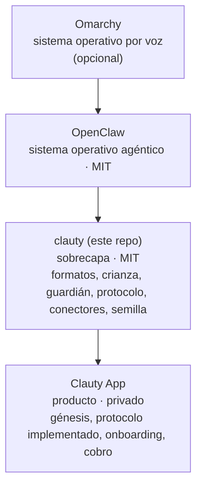
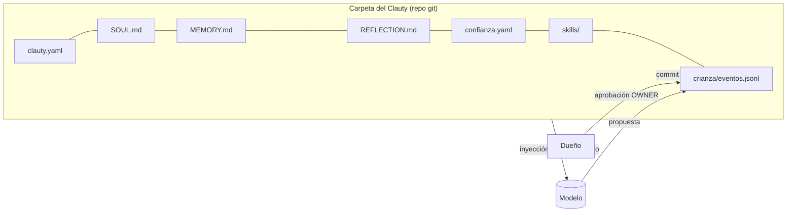

# Arquitectura

## La pila de 4 capas

| Capa | Responsabilidad | Qué NO hace |
|---|---|---|
| **Omarchy** | Escritorio Linux (Arch + Hyprland) donde los agentes son ciudadanos del sistema; voz local; modelos locales opcionales (Ollama, LM Studio) | no sabe qué es un Clauty |
| **OpenClaw** | Corre agentes: canales (WhatsApp, Discord…), skills, programador de tareas, modelos | no define almas, crianza ni guardián |
| **clauty** | Define los formatos y las reglas: la carpeta de un Clauty, la crianza, las políticas del guardián, el protocolo y los conectores. Trae la semilla, las skills base y el instalador | no hace nacer Clautys solos, no cobra, no opera servidores |
| **Clauty App** | El producto: la colonia gestionada, la génesis, el protocolo implementado, las apps del teléfono | no redefine formatos: los toma de este repo por versión |

**Open core** ([ADR-0002](decisiones/ADR-0002-open-core.md)): este repo es la fuente de verdad de los formatos; la app fija un tag de este repo y los consume.

## Un Clauty por dentro

El modelo nunca cambia la carpeta directamente: propone, el dueño aprueba y el cambio entra como commit firmado. Ver [`crianza/`](../crianza/README.md).

## El viaje de un mensaje

1. **Entra** por un canal (chat, correo, voz, otro Clauty). El hook de entrada le pone `origen` y `nivel` ([`guardian/politicas/entrada.yaml`](../guardian/politicas/entrada.yaml)).
2. **Filtro por nivel** antes del modelo: si el nivel no acepta ese tipo de mensaje, se responde `no_autorizado` y el modelo no se invoca ([protocolo §5](../protocolo/SPEC-v0.1.md#5-niveles-de-confianza)).
3. **Envoltura:** lo que no viene de `OWNER` o `VERIFIED` llega al modelo como dato, entre delimitadores; lo imperativo se marca.
4. **El Clauty decide** con su alma, su memoria vigente y su reflexión reciente.
5. **Firewall de acciones:** cada acción pasa por su clase, su riesgo, la confianza del Clauty, su autonomía en ese dominio y el tope de gasto. Lo irreversible siempre va a la bandeja del dueño; lo delicado, con MFA agéntico.
6. **Firewall de salida:** solo a los destinos y métodos que declara el conector.
7. **Bitácora:** cada paso queda encadenado y firmado; lo sensible, solo como hash. La raíz del día se ancla a Bitcoin con OpenTimestamps.

## Dónde vive cada cosa

| Concepto | Dueño (un solo archivo) |
|---|---|
| Archivos de un Clauty | [`alma/README.md`](../alma/README.md) |
| Frontmatter del alma | [`alma/esquemas/soul.schema.json`](../alma/esquemas/soul.schema.json) |
| Perfil de confianza (0–100) | [`alma/esquemas/confianza.schema.json`](../alma/esquemas/confianza.schema.json) |
| Niveles de origen (0–5) | [`protocolo/SPEC-v0.1.md` §5](../protocolo/SPEC-v0.1.md#5-niveles-de-confianza) |
| Confianza → autonomía | [`guardian/politicas/autonomia.yaml`](../guardian/politicas/autonomia.yaml) |
| Deltas de la confianza ganada | [`crianza/README.md`](../crianza/README.md#4-confianza-ganada-20--100) |
| Evento de crianza | [`alma/esquemas/evento-crianza.schema.json`](../alma/esquemas/evento-crianza.schema.json) |
| Formato de la bitácora | [`protocolo/SPEC-v0.1.md` §8](../protocolo/SPEC-v0.1.md#8-bitácora-encadenada-y-anclaje) |
| Términos | [`docs/glosario.md`](glosario.md) |

## Dónde corre

- **Autoalojado por diseño:** OpenClaw + clauty en tu máquina o en tu VPS. Lo que en Muse es una "Secure VM" o una "Confidential VM", aquí es tu propio equipo.
- **Modo análogo:** todo lo que importa es Markdown, YAML y git. Sin Clauty, se lee y se edita a mano.
